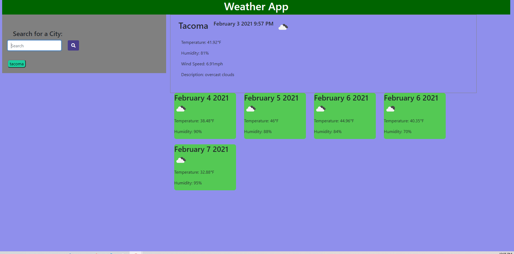

# Weatherapp
Have you ever wanted to know what the current/next 5 days of weather will be like? Do you have no windows and weren't born with the ability to see into the future?
Then you have come to the right place! This is my [Weather App](https://ashleywhaley.github.io/Weatherapp/)

## Languages 

I couldn't have down it without using Jquery, JavaScript, Moment.js, HTML, Bootstrap and CSS!

## Description 
When page is load, I do have to admit, it seems very blank. Once a city is entered into the textbox then the magic happens. To the right the current weather fills out the top while the next 5 days of weather is below! If you can't decide whether it will rain or snow but the humidity and temperature then I have added weather icons to better assist. 

## Acceptance Criteria

```
GIVEN a weather dashboard with form inputs
WHEN I search for a city
THEN I am presented with current and future conditions for that city and that city is added to the search history
WHEN I view current weather conditions for that city
THEN I am presented with the city name, the date, an icon representation of weather conditions, the temperature, the humidity, the wind speed, and the UV index
WHEN I view the UV index
THEN I am presented with a color that indicates whether the conditions are favorable, moderate, or severe
WHEN I view future weather conditions for that city
THEN I am presented with a 5-day forecast that displays the date, an icon representation of weather conditions, the temperature, and the humidity
WHEN I click on a city in the search history
THEN I am again presented with current and future conditions for that city
```

## Screenshot

